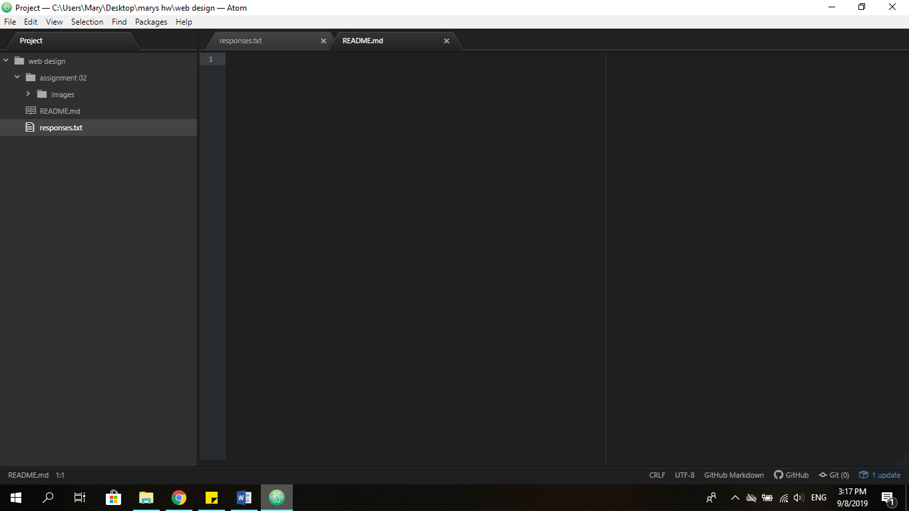

# Assignment 2

## Mary Primeau

I have decided to take this class because I am interested in learning more about
coding and how to create a basic website. I have a little experience with HTML
but not a lot only creating minor images but how to really make a website. I am
looking forward to working with CSS it seems to be widely used. I have already
learned many things about how the internet works and how information is received.

Here is a list of things I have learned

- How information is sent on the internet.
- The difference between the web and the internet.
- What a bit is.

A website I frequent is [YouTube](https://www.youtube.com)

A link to my [responses](./responses.txt)

A link to my  
