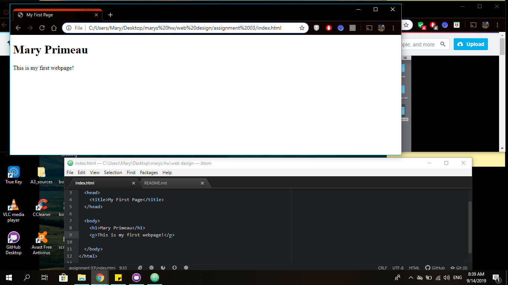

# Assignment 3

## Mary Primeau

Very briefly detail how browsers function. List any browsers you currently use to surf - or even develop for - the web.

A browser is a program that lets the user access the internet. I prefer to use Chrome, but sometimes I use Safari on my IPad.
The browser allows the user to view what information they would like to see, such as images or text. All browsers have a URL which
helps navigate the internet. The browsers also have rendering engines on them that read HTML and CSS and then displays them for the user.

What is a markup language? Describe one commonly used in development.

Markup language is a combination of markup, style, and scripts. This language is used to display text and images using a browser.
HTML is a common language in development, this language is very common on the web. HTML is used as a structure and foundation of a webpage.  

An embedded image of your screenshot using its relative URL.
Here is a link to my 
