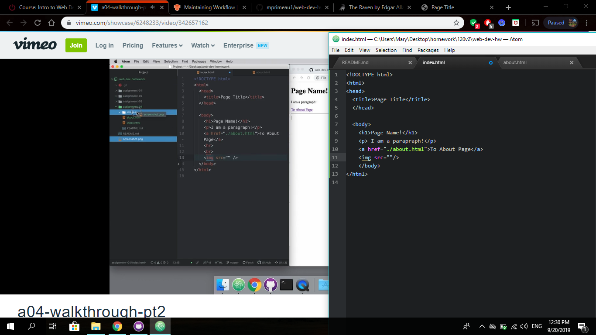

# Assignment 04
## Mary Primeau

Visit a site using The Wayback Machine, looking at a snapshot at least 10 years old. Where did you go? What did it look like? How has it changed?
I used The Wayback Machine and looked at the website www.facebook.com. The page looks way different then it does today. Everything seems more angular and a more simpler design. The famous blue and white is main colors just as is today. Another thing I noticed was it doesn't say join now it says register.

Summarize your experience with the GIT Module. What did you learn? What was difficult, easy, or still misunderstood?
I have used GIT before for another class. This is a great reminder of how to use the platform.

An embedded image of your screenshot using its relative URL
Here is a cool screenshot of while I was working on my Assignment 04.

